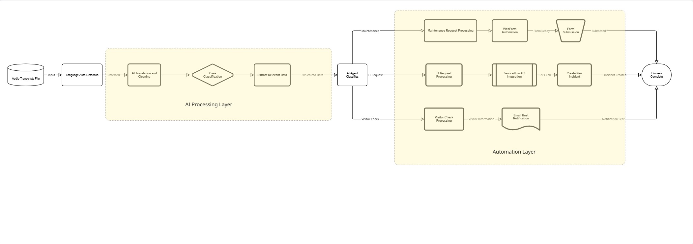
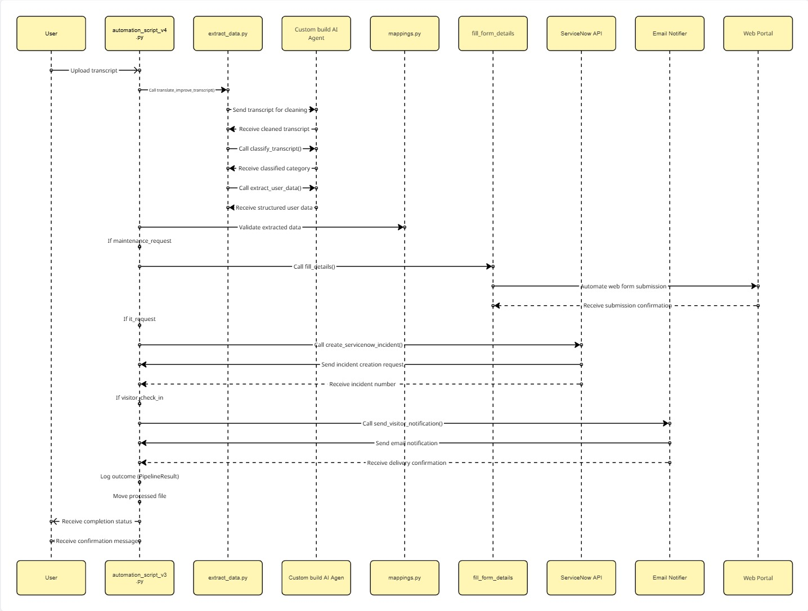

# Collagis - AI-Powered Maintenance Request Automation System

*Intelligent multilingual transcript processing and automated form submission for property maintenance*

[](https://www.pathfindr.ai/)
[](https://python.org)
[](https://openai.com/)
[](https://selenium.dev/)
[](#supported-languages)

---

## Overview

**Collagis** is an intelligent AI-powered automation system that processes multilingual audio transcripts and automatically performs form submissions or notifications based on the detected case type.

The system currently supports three automation flows:

- **Webform Request** – Extracts and submits maintenance-related information to the Victorian Government’s Maintenance Portal.  
- **IT Request** – Classifies and processes IT-related issues, automatically creating ServiceNow incidents.  
- **Visitor Check-In** – Detects and processes visitor-related transcripts, sending appropriate email notifications.

By combining **advanced natural language processing (NLP)** with **automated form handling and integrations**, Collagis streamlines the end-to-end workflow for maintenance, IT support, and visitor management — even across multiple languages and unstructured transcript formats.

## System Architecture

### Core Components


### Data Flow Architecture


## Key Features

### Intelligent Processing Workflow
1. **Automatic Language Detection** – Automatically identifies the transcript language; no manual selection required.  
2. **Transcript Selection** – Select transcript files for processing via file browser or folder-based automation.  
3. **AI Classification** – Automatically classifies each transcript into one of three categories:  
   - **Webform Request**  
   - **IT Request**  
   - **Visitor Check-In**  
4. **Data Extraction** – GPT-4o-powered extraction of structured information from natural language transcripts.  
5. **Automated Actions** – Executes case-specific workflows:
   - **Webform Request** → Submits maintenance-related data to the Victorian Government’s Maintenance Portal.  
   - **IT Request** → Creates incidents directly through the **ServiceNow API integration**.  
   - **Visitor Check-In** → Sends an **email notification** to the host upon visitor arrival.

### Supported Operations
- **Automatic Language Handling** – Supports English, Vietnamese, Bahasa Indonesia, and Hindi through automatic detection.  
- **Intelligent Mapping** – Advanced NLP ensures accurate classification and data mapping for each case type.  
- **Smart Automation** – Selenium-based automation for seamless form submission and workflow execution.  
- **Error Handling** – Robust logging, recovery, and validation to ensure consistent performance.

### Property Maintenance Features
- Supports both **Home** and **Common Area** repair categories.  
- Handles **Inside/Outside** location identification automatically.  
- Classifies detailed issue types — Access, Cleaning, Electrical, Gas, Water, and Other.  
- Tracks **historical maintenance patterns** (6-month reporting window).

## Technology Stack

### Backend & Core
- **Python 3.12** - Core programming language
- **Selenium WebDriver** - Web automation framework
- **PyInstaller** - Application packaging and distribution

### AI & NLP
- **OpenAI GPT-4o** (model: `gpt-5-mini`) - Advanced language processing
- **Pydantic** - Data validation and structured parsing
- **LangChain Integration** - AI workflow management

### Data Processing
- **python-dotenv** - Environment configuration
- **JSON Transcript Format** - Structured conversation data
- **Dynamic Mapping System** - Issue categorization engine

### Web Automation
- **Chrome WebDriver** - Browser automation
- **Element Interaction** - Advanced form filling techniques
- **Exception Handling** - Robust error recovery

## Installation & Setup

### Prerequisites
- Python 3.12
- Google Chrome browser installed
- ChromeDriver compatible with your Chrome version
- OpenAI API key with GPT-4o access
- Internet connection for AI processing and form submission

### Installation Steps

1. **Clone the repository**
   ```bash
   git clone https://github.com/pathfindr-ai/collagis.git
   cd collagis
   ```

2. **Install dependencies**
   ```bash
   pip install -r requirements.txt
   ```

3. **Environment Configuration**
         
      ## Create a `.env` file
      You can copy them from `.env.example` or create one manually.

      Add or verify the following key variable in your `.env` file:
      ```bash
      SMOKE_TEST=False
      ```

      - Set `SMOKE_TEST=False` when testing the flow (e.g., verifying the webform process without actually submitting the form).
      - Set `SMOKE_TEST=True` in production or normal runs to enable real form submission.

      ## Update the `.env` File with Absolute Paths

      Make sure all paths in your `.env` file are absolute and correctly point to your local directories.

      **Example:**
      ```bash
      TRANSCRIPTS_FOLDER=/Users/mini/Downloads/collagis/assets
      HOSTS_CSV_PATH=/Users/mini/Downloads/collagis/assets/hosts.csv
      REPORTS_FILE=/Users/mini/Downloads/collagis/assets/reports/flow_reports.json
      ```

4. **transcript files**
   - Place transcript in the assets folder


5. **Run the application**
   ```bash
   python -m v4.automation_script_v4
   ```

## Configuration

### Transcript Format

The system expects JSON-formatted transcripts with the following structure:
```json
{
  "Author": "ChatGPT",
  "Text": "Please tell me your first name."
},
{
  "Author": "User",
  "Text": "John Smith"
}
```
### Host CSV Format

The system expects a CSV file containing host information in the following format:

```csv
name,email
John Smith,john@gmail.com
Sarah Lee,sarah.lee@company.com
```

### Issue Mapping System

The application uses a comprehensive mapping system defined in `mappings.py`:

| Category | Description |
|----------|-------------|
| **Location Types** | Differentiates between `My Home` and `Common Area` |
| **Area Specifications** | Categorizes the issue as `Inside` or `Outside` |
| **Issue Categories** | Groups issues under major types: Access, Cleaning, Electrical, Gas, Water, or Other |
| **Specific Issues** | Provides detailed subcategories based on the selected location and issue type |

## Data Extraction and Processing Workflow

### Intelligent Data Flow

Collagis uses an AI-driven multi-stage pipeline to analyse and process transcript data.  
Each transcript is automatically translated, classified, and structured for one of three automation workflows:
- **Webform Request** (Maintenance)
- **IT Request** (ServiceNow Incident)
- **Visitor Check-In** (Email Notification)

---

### Data Extraction Process

1. **Automatic Language Detection**  
   The system detects the transcript’s language automatically — no manual selection required.

2. **Transcript Cleaning and Translation**  
   Non-English transcripts are translated into English with grammatical and structural corrections using GPT-4o.

3. **Case Classification**  
   The AI classifies the transcript into one of three supported categories:  
   - `maintenance_request`  
   - `it_request`  
   - `visitor_check_in`

4. **Entity and Intent Extraction**  
   Extracts structured data such as personal details, issue descriptions, and contextual information specific to the detected case.

5. **Data Validation and Mapping**  
   Validates the extracted fields against required schemas for each workflow (maintenance, IT, visitor).

6. **Automated Action Execution**  
   Based on classification, the appropriate automation is triggered:  
   - **Maintenance Request:** Submits the extracted data to the Victorian Government’s Maintenance Webform.  
   - **IT Request:** Creates a new incident via the ServiceNow API.  
   - **Visitor Check-In:** Sends a check-in email to the identified host.

---

## API Integration

### OpenAI GPT-4o Integration

Collagis relies on OpenAI’s **GPT-4o** for both language processing and structured data extraction.

#### Translation and Cleaning
- **Purpose:** Translate non-English transcripts and improve linguistic clarity.  
- **Model:** `gpt-5-mini`  
- **Input:** Raw transcript text  
- **Output:** Cleaned and grammatically corrected English transcript  

#### Intent Classification
- **Purpose:** Classify the transcript into one of the predefined categories based on its context and intent.  
- **Model:** `gpt-5-mini` 
- **Schema:** `TranscriptCategory` (Pydantic model enforcing valid categories)  
- **Categories:**  
  - `maintenance_request` — For maintenance or repair-related conversations (e.g. plumbing, electrical, facility issues).  
  - `it_request` — For IT or technical issues (e.g. system access, device malfunction, network problems).  
  - `visitor_check_in` — For visitor arrival or check-in scenarios.  
  - `not_found` — When the transcript does not clearly fit any supported case.  
- **Prompt Behaviour:**  
  The model acts as a **strict classifier**, evaluating transcript content and returning *exactly one* of the supported categories.  
- **Response Format:** Structured output using the `TranscriptCategory` Pydantic schema.  

#### Structured Data Extraction
- **Purpose:** Extract context-specific fields required for automation.  
- **Model:** `gpt-5-mini` 
- **Validation:** Field-level mapping and consistency checks.  
- **Response Format:** Pydantic models for each case type.  

---

### Data Models

#### Maintenance Request (`maintenance_request`)

```python
class MaintenanceUserData(BaseModel):
    first_name: str
    last_name: str
    phone: str
    email: str
    address: str
    repair_type: Literal['Home', 'Common']
    issue_location: Literal['Inside', 'Outside']
    issue_area: str
    issue_type: Literal['Access','Cleaning','Electrical','Gas','Water','Other']
    issue_detail: str
    issue_text: str
    previous_issue: str
    appointment_times: Optional[str] = None
    access_instructions: Optional[str] = None
```

#### IT Request (it_request)
```python
class IncidentData(BaseModel):
    caller_id: str
    short_description: str
    comments: str
    impact: str
    urgency: str
```

#### Visitor Check-In (visitor_check_in)
```python
class VisitorData(BaseModel):
    full_name: str
    company: str
    purpose: str
    check_in_time: Optional[str] = None
    notes: Optional[str] = None
    host_name: str
```

## Processed File Ledger

Collagis uses an SQLite database to track processed files and prevent duplicate processing:

- **Location**: `{REPORTS_FILE directory}/processed.db`
- **Deduplication**: Files are tracked by SHA256 hash
- **Automatic Cleanup**: Entries older than `LEDGER_CLEANUP_DAYS` are purged daily
- **Concurrency**: WAL mode enabled for better concurrent access

### Configuration

| Variable | Default | Description |
|----------|---------|-------------|
| `LEDGER_CLEANUP_DAYS` | 90 | Days to retain processed file records |
| `REPORTS_FILE` | `./assets/reports/flow_reports.json` | Determines database location |
| `LOAD_ALL_HASHES` | True | If True, loads all processed file hashes into memory (useful for small datasets). Set to False for large datasets to use lazy checks. |


## Supported Languages

| Language | Support Level | Sample Files |
|----------|---------------|--------------|
| **English** | Native | ✅ Full support |
| **Vietnamese** | AI Translation | ✅ Full support |
| **Bahasa Indonesia** | AI Translation | ✅ Full support |
| **Hindi** | AI Translation | ✅ Full support |

## Form Automation Details

### Target Portal
- **URL**: https://cbwebform.innovationlab360.com/"
- **Form Type**: Dynamic web application with dropdowns and validation

### Automation Features
- **Smart Element Detection**: Robust XPath and CSS selector strategies
- **Dynamic Wait Handling**: Intelligent waiting for element availability
- **Error Recovery**: Fallback mechanisms for element interaction failures
- **Form Validation**: Pre-submission data validation
- **User Verification**: Browser remains open for manual review

## Security Considerations

- **API Key Management**: Secure environment variable handling
- **Data Privacy**: No persistent storage of personal information
- **Browser Security**: Automated form submission with user oversight
- **Input Validation**: Comprehensive data sanitization
- **Error Logging**: Secure logging without exposing sensitive data

## Troubleshooting

### Common Issues

1. **ChromeDriver Compatibility**
   - Ensure ChromeDriver matches your Chrome browser version
   - Download from: https://chromedriver.chromium.org/
   - macOS: `brew install --cask google-chrome && brew install chromedriver`

2. **OpenAI API Issues**
   - Verify API key is valid and has access to GPT-5 or the model specified in the environment variable
   - Check API usage limits and billing status
   - Ensure stable internet connection

3. **Transcript Processing Errors**
   - Verify transcript files are in valid JSON format
   - Check file permissions and encoding (UTF-8)
   - Ensure proper conversation structure

4. **Form Automation Failures**
   - Check if the target website structure has changed
   - Verify internet connectivity
   - Ensure Chrome browser is up to date

### Debug Mode
Enable debug logging by modifying the script to include additional print statements and error details.

## Development & Deployment

### Development Setup
- Use virtual environment for dependency isolation
- Install development dependencies for testing
- Configure IDE with Python 3.8+ interpreter

### Application Packaging
```bash
pyinstaller --onefile \
  --name "AutomationApp" \
  v4/automation_script_v4.py
```

### Production Considerations
- Secure API key storage
- Regular ChromeDriver updates
- Monitor OpenAI API usage
- Implement logging and monitoring
- Consider headless browser mode for server deployment

## Contributing

When contributing to this project:
1. Follow existing code style and patterns
2. Add appropriate error handling for new features
3. Update documentation for any changes
4. Test with sample transcript files across all languages
5. Ensure AI prompt engineering maintains accuracy
6. Validate form automation compatibility

## Version History
- **v4**: Current version with the support of 3 cases
- **v3**: Current version with enhanced multilingual support
- **v2**: Improved AI integration and error handling
- **v1**: Initial prototype with basic automation

## 📄 License & Ownership

This project is proprietary software developed by **Pathfindr AI**.

### Contact & Support

#### Technical Development Support
- **Pathfindr AI Development Team**: [Contact Pathfindr](https://www.pathfindr.ai/contact)
- **Pathfindr AI Website**: [https://www.pathfindr.ai/](https://www.pathfindr.ai/)

#### System Administration
- **Primary Support**: Pathfindr AI Technical Team
- **Emergency Escalation**: [Emergency Contact Information]

---

## 🚀 About This Project
Collagis is an intelligent AI-powered automation system that processes multilingual audio transcripts and automatically performs form submissions or notifications based on the detected case type.

### Technology Innovation
- **Advanced NLP**: Leveraging OpenAI's GPT-4o for accurate multilingual transcript processing
- **Intelligent Automation**: Selenium-based form automation with robust error handling
- **Multi-Language Intelligence**: Purpose-built for handling diverse linguistic patterns and cultural contexts

### Built by Experts
Developed by **Pathfindr AI** - specialists in AI-powered automation solutions and multilingual natural language processing. Our team combines deep expertise in government systems with cutting-edge artificial intelligence to deliver transformative public service solutions.

**[Learn more about Pathfindr AI's automation solutions →](https://www.pathfindr.ai/)**

---

**Built with ❤️ by [Pathfindr AI](https://www.pathfindr.ai/)**

*Supercharge today. Reimagine tomorrow.* - Pathfindr AI
